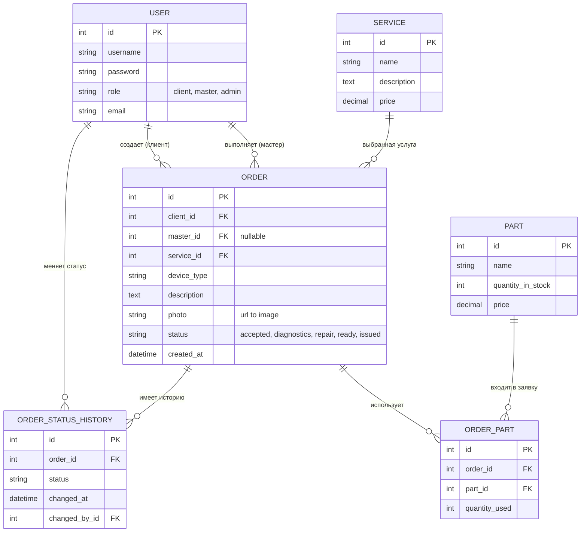

# ER-диаграмма базы данных

```mermaid
erDiagram
    USER {
        int id PK
        string username
        string password
        string role "client, master, admin"
        string email
    }

    SERVICE {
        int id PK
        string name
        text description
        decimal price
    }

    ORDER {
        int id PK
        int client_id FK
        int master_id FK "nullable"
        int service_id FK
        string device_type
        text description
        string photo "url to image"
        string status "accepted, diagnostics, repair, ready, issued"
        datetime created_at
    }

    ORDER_STATUS_HISTORY {
        int id PK
        int order_id FK
        string status
        datetime changed_at
        int changed_by_id FK
    }

    PART {
        int id PK
        string name
        int quantity_in_stock
        decimal price
    }

    ORDER_PART {
        int id PK
        int order_id FK
        int part_id FK
        int quantity_used
    }

    %% Связи (Relationships)
    USER ||--o{ ORDER : "создает (клиент)"
    USER ||--o{ ORDER : "выполняет (мастер)"
    USER ||--o{ ORDER_STATUS_HISTORY : "меняет статус"
    SERVICE ||--o{ ORDER : "выбранная услуга"
    ORDER ||--o{ ORDER_STATUS_HISTORY : "имеет историю"
    ORDER ||--o{ ORDER_PART : "использует"
    PART ||--o{ ORDER_PART : "входит в заявку"
```
